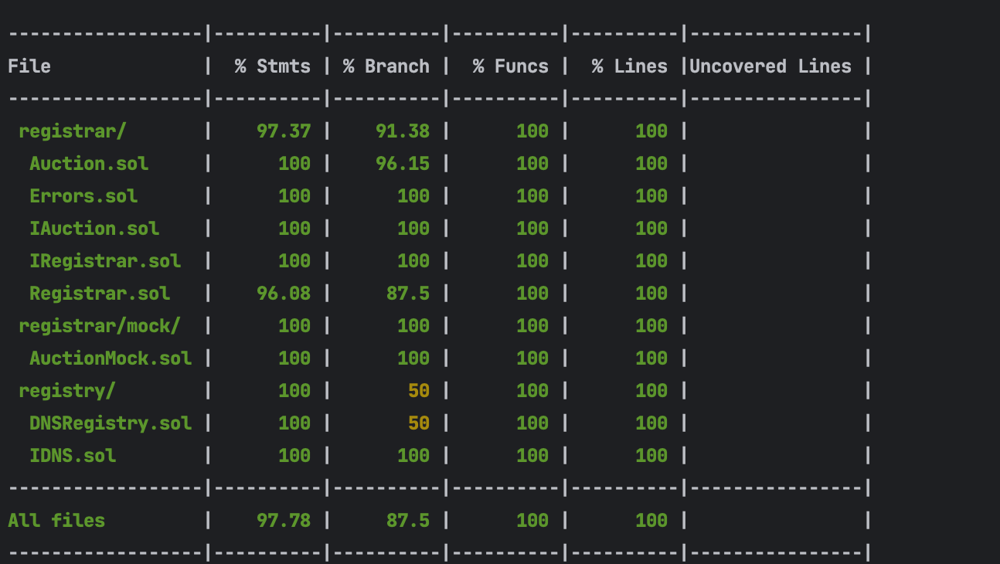

# [CZ4153 - Decentralized DNS](https://github.com/isaiahwong/cz4153)
The following repo defines the implementation of a decentralized DNS on the Ethereum blockchain. The DNS is fully decentralized featuring smart contracts and a frontend built with [React](https://react.dev/). 

### Members
- Isaiah Wong
- Jefferson Liew
- Ye Xin

[Github](https://github.com/isaiahwong/cz4153)

# About
The DNS utilizes a blind auction `commit and reveal` scheme where the bid of each commitment is hidden. 
In order to successfully bid for a domain, the user have to submit `3` Ethereum transactions in total.

### 1. Commitment 
- Users will submit a bid `upfront` and a `commitment`.
- The transaction submitted links the payment to the precommitment.
- Domain name will not be part of tx to prevent correlation between the domain and the bid.
- Smart contract stores mapping of commitment to bid
> Commitment = sha3(address, domainHash, secret)

### 2. Bidding process
- Users submits the `secret` and domain name for bidding process. 
- Smart contract will recreate the commitment and retrieve bid for the commitment.
- Starts auction process
> A plaintext domain is supplied as it is used for emitting an auction for the domain.

### 3. Reveal process
- Users will reveal the bid where the `plaintext` secret is submitted. The smart contract will reconstruct the commitment via hashing.
- If user's bid is the highest, the smart contract will mint and allocate the domain to the user.
- Else, the user will be refunded the amount bid prior.

## Folder structure
.
├── README.md
├── addresses.local.json
├── addresses.sepolia.json
├── contracts
├── frontend
├── hardhat.config.ts
├── package.json
├── scripts
├── test
└── tsconfig.json


# Contents
1. [Setting up Environment](#setting-up-environment)
2. [Quickstart](#quickstart-)
3. [Running Locally](#running-locally)
4. [Deploying to Sepolia](#deploying-to-sepolia)
5. [Configuration](#configuration-after-deployment)


# Setting up Environment

The dApp is a React SPA that utilizes NodeJS and Metamask. You can install the following with the links supplied below. 
- [NodeJS](https://nodejs.org/en)
- [Metamask](https://metamask.io/download/)

# Quickstart 
> Warning, do not switch networks in the middle of a bidding. It clears the localstorage cache. 

The smart contracts have been deployed on the testnet `Sepolia network` where you can run the `DNS dApp` directly without running a local node.

### 1. Enable testnet on metamask
1. On Metamask, select networks and enable test networks.
2. Select `Sepolia` network.

### 2. Getting ether for Sepolia testnet
In order to interact with the dApp, you require some ether. You can attain some from [Sepolia Faucet](https://sepoliafaucet.com/). Supply your wallet address to attain some ether.

### 3. Running the dApp
```
$ cd frontend && npm i
$ npm run start
```

### Sepolia Deployed Addresses
```
  "dns": "0x1bEc6C3e40f4E77cc4bbf58EA412764159d48718",
  "ntuRegistrar": "0xfca0C7221AaA904fE2612F78e0148EB41CaEa676",
  "devRegistrar": "0xF8B620c109B9b96888EF98600faDd907EF00BEFF",
  "comRegistrar": "0x9f3EBbFf77a37BfCF3a71Ec95534c8bd65c4bd5B",
  "xyzRegistrar": "0x114a16a2002CEa9821f724f49618D8ac1eb059c7"
```

## Running Locally
Alternatively, you can run your own local node and deploy the contracts locally.

### 1. Install dependencies 
In the root of the project, install the dependencies
```
$ npm i
```

### 2. Run the local Ethereum node via hardhat
Open a new shell and start the hardhat node
```
$ npm run node

or 

$ npx hardhat node
```

### 3. Deploy contracts
Open another new shell and deploy the smart contracts
```
$ npm run deploy
```
> The contract addresses is generated in the root folder `address.local.json`

### 4. Adding hardhat to metamask
1. On Metamask, select networks and add a new network.
2. Select on `Add a network manually`
3. Fill in localhost network details.


### 5. Run the dApp
```
$ cd frontend 
$ npm i
$ npm run start
```

### 6. Transfer test ether to your metamask account
> Remember to reset the EOA nonce when you restart the local node
> `Go to settings > search for nonce > clear activity and nonce data`

```
# npm run transfer 0xfcAD4cD2634878b216404ee9fFF3eDC20Ca08a4a
$ npm run transfer <YOUR_EOA_ADDRESS>
```

### 7. [Optional not recommended] Using preloaded hardhat accounts with test ether
You may add the dummy private keys to metamask to use the preloaded accounts with test ether.

> Warning, delete the private keys after usage as they are exposed in the repo.

1. Keys are under `hardhat.config.ts`
2. Import private key to metamask

# Deploying to Sepolia
You can deploy the contracts to sepolia where the contracts will be updated in source.
> Note: This will override the existing contracts in source.

1. Rename the `.env.cp` to `.env`
```
$ mv .env.cp .env
```

2. Update the environment file with your private key and Node URL such as Infura or Alchemy
```
SEPOLIA_URL=YOUR_NODE_URL
DEPLOYER_PRIVATE_KEY=YOUR_DEPLOYER_PRIVATE_KEY
```

3. Deploy the contracts
```
$ npm run deploy:sepolia
```

# Configuration after deployment 
### Configuring the auction duration
**Parameters**
- `REGISTRAR` - The registrar contract to configure. Refer the list of registrars in `addresses.local.json`.
- `DURATION_IN_SECONDS` - The duration of the auction in seconds.

Local Hardhat
```
#  npm run auction_duration ntuRegistrar 30
$  npm run auction_duration <REGISTRAR> <DURATION_IN_SECONDS>
```

Sepolia
> Ensure that you have deployed a new set of contracts to Sepolia and your `.env` is defined. 
```
# npm run auction_duration:sepolia ntuRegistrar 60
$ npm run auction_duration:sepolia <REGISTRAR> <DURATION_IN_SECONDS>
```

# Running Tests
```
$ npm run test
```

## Test coverage


```
$  npm run coverage
```

## Screenshots
### Landing 


### Bidding


### All auctions
